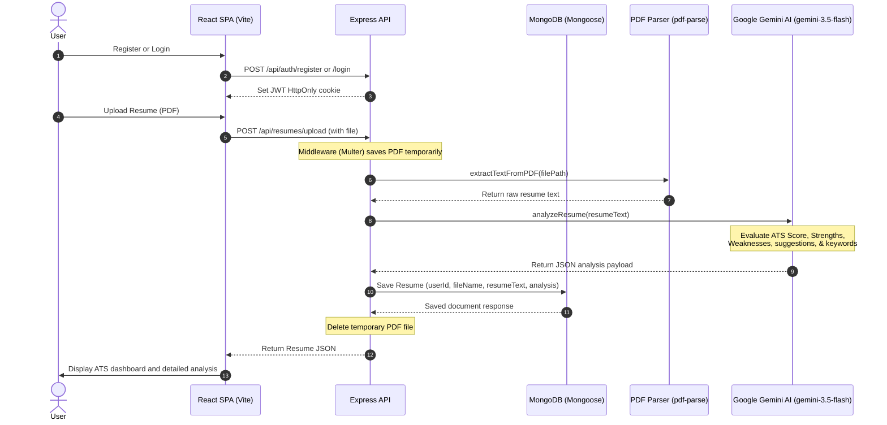

# AI-Powered Resume Analyzer

An elegant, full-stack application that analyzes PDF resumes using Google Gemini AI, calculating an ATS score, highlighting strengths and weaknesses, identifying missing keywords, and providing actionable improvement suggestions.

---

## 🏗️ System Architecture & Data Flow

Below is a diagram showing how the Frontend, Backend, PDF Parser, and Google Gemini AI services interact to process and analyze a resume:



---

## ✨ Features

### Frontend (Client-side)
* **Modern & Clean User Interface**: Styled with sleek dark mode aesthetics and responsive designs using Tailwind CSS.
* **Authentication Flows**: User registration, login, and protected routing supported by React Context.
* **Interactive Dashboard**: View total resumes uploaded, highest ATS score, average ATS score, and a list of all analyzed resumes.
* **Resume Detail Analysis**: Beautiful charts/visualizations representing:
  * **ATS Score Gauge**
  * **Strengths & Weaknesses checklists**
  * **Missing keywords badges**
  * **Step-by-step improvement recommendations**
* **Instant PDF Uploads**: Drag-and-drop or select PDF files with automatic validation.

### Backend (Server-side)
* **Cookie-based JWT Auth**: HttpOnly, secure cookies for token management and validation middleware.
* **Multipart File Handling**: Multer configured to handle file storage and immediate cleanup post-analysis.
* **PDF Processing**: Seamless text extraction from binary PDF buffers.
* **AI Analysis Pipeline**: Integrated with the latest `@google/genai` SDK using the fast and powerful `gemini-3.5-flash` model.
* **MongoDB Integration**: Persisting user accounts and parsed resumes with Mongoose schemas.

---

## 🛠️ Technology Stack & Dependencies

### Frontend
* **Framework**: React 19 (TypeScript)
* **Build Tool**: Vite
* **Styling**: Tailwind CSS
* **Routing**: React Router DOM (v6)
* **Form Handling**: React Hook Form
* **HTTP Client**: Axios (configured with `withCredentials: true` for HTTP-only cookie passing)
* **Icons**: Lucide React

### Backend
* **Runtime**: Node.js (ES Modules import/export)
* **Framework**: Express.js (v5)
* **Database ORM**: Mongoose (MongoDB)
* **File Uploads**: Multer
* **Text Extraction**: pdf-parse
* **AI integration**: `@google/genai` (SDK version `^2.8.0`)
* **Security & Auth**: bcryptjs (for password hashing), jsonwebtoken (JWT validation)
* **Config Management**: dotenv, cookie-parser, cors

---

## 📁 Repository Directory Structure

```text
Resume_Analyser/
├── Backend/
│   ├── src/
│   │   ├── config/
│   │   │   └── db.js            # MongoDB connection configuration
│   │   ├── controllers/
│   │   │   ├── auth.controller.js     # User registration, login, logout, me
│   │   │   └── resume.controller.js   # Resume upload, retrieval, and delete
│   │   ├── middleware/
│   │   │   ├── auth.middleware.js     # JWT cookie verification middleware
│   │   │   └── upload.middleware.js   # Multer file upload setup (temp storage)
│   │   ├── models/
│   │   │   ├── Resume.js        # Resume MongoDB schema
│   │   │   └── User.js          # User MongoDB schema
│   │   ├── routes/
│   │   │   ├── auth.routes.js   # Authentication routing paths
│   │   │   └── resume.routes.js # Resume analysis & CRUD routing paths
│   │   ├── services/
│   │   │   ├── ai.service.js    # Google Gemini AI prompts & parsing
│   │   │   └── pdf.service.js   # PDF text extraction utility
│   │   ├── utils/
│   │   │   └── generateToken.js # JWT signing utility
│   │   ├── app.js               # Express application and CORS setup
│   │   └── server.js            # Main server entrypoint (ports and DB startup)
│   ├── uploads/                 # Local directory for temporary file processing
│   ├── .env.example             # Example backend environment configuration
│   ├── package.json             # Backend dependencies & scripts
│   └── README.md                # Backend specific readme
│
├── Frontend/
│   ├── public/                  # Static assets
│   ├── src/
│   │   ├── api/
│   │   │   ├── authApi.ts       # Authentication API Axios calls
│   │   │   ├── axios.ts         # Base Axios client instance with CORS config
│   │   │   └── resumeApi.ts     # Resume upload & analysis Axios calls
│   │   ├── components/
│   │   │   ├── common/
│   │   │   │   ├── Footer.tsx   # Shared Footer component
│   │   │   │   └── Header.tsx   # Navigation bar with login/logout states
│   │   │   └── LoadingScreen.tsx# Preloader with animated progress bar
│   │   ├── context/
│   │   │   └── AuthContext.tsx  # User state management context
│   │   ├── hooks/
│   │   │   └── useAuth.ts       # Hook to access AuthContext
│   │   ├── pages/
│   │   │   ├── Dashbord.tsx     # Dashboard table of past analyses & stats
│   │   │   ├── Landing.tsx      # Welcome landing page
│   │   │   ├── Login.tsx        # Sign-in form
│   │   │   ├── Register.tsx     # Account registration form
│   │   │   ├── ResumeDetails.tsx# Full breakdown of the Gemini analysis output
│   │   │   └── ResumeUpload.tsx # Drag/drop file uploader component
│   │   ├── routes/
│   │   │   └── ProtectedRoute.tsx# Navigational guard for private pages
│   │   ├── types/
│   │   │   ├── resume.ts        # Resume TypeScript declarations
│   │   │   └── user.ts          # User TypeScript declarations
│   │   ├── App.css              # Custom global styles
│   │   ├── App.tsx              # Application layout grid
│   │   ├── index.css            # Base stylesheet importing Tailwind
│   │   └── main.tsx             # Application bootstrap & router configurations
│   ├── .env.example             # Example frontend environment configuration
│   ├── package.json             # Frontend dependencies & scripts
│   ├── tsconfig.json            # TypeScript configuration
│   ├── vite.config.ts           # Vite configuration setup
│   └── README.md                # Frontend specific readme
│
└── README.md                    # Root workspace documentation
```

---

## 🗄️ Database Schemas

The backend persists data using two key MongoDB schemas:

### 1. User Schema (`User.js`)
Stores user details for authentication.
```javascript
{
  name: { type: String, required: true },
  email: { type: String, required: true, unique: true },
  password: { type: String, required: true }, // Hashed using bcrypt
  timestamps: true // Auto-generates createdAt and updatedAt
}
```

### 2. Resume Schema (`Resume.js`)
Stores the text content of the resume along with the analysis response returned by Gemini AI.
```javascript
{
  userId: { type: mongoose.Schema.Types.ObjectId, ref: "User", required: true },
  fileName: { type: String },
  resumeText: { type: String },
  analysis: {
    atsScore: { type: Number, default: 0 },
    summary: { type: String, default: "" },
    strengths: { type: [String], default: [] },
    weaknesses: { type: [String], default: [] },
    suggestions: { type: [String], default: [] },
    missingKeywords: { type: [String], default: [] }
  },
  timestamps: true
}
```

---

## 🔌 API Endpoints Reference

### 🔐 Authentication (`/api/auth`)

| HTTP Method | Route | Description | Auth Required | Request Body | Response Success (200/201) |
|---|---|---|---|---|---|
| **POST** | `/register` | Register a new user account | No | `{ name, email, password }` | `{ success: true, message: "User registered", user }` |
| **POST** | `/login` | Log in and receive JWT token cookie | No | `{ email, password }` | `{ success: true, message: "Login successful" }` + Cookie |
| **POST** | `/logout` | Clear the authorization token cookie | No | None | `{ success: true, message: "Logged out" }` |
| **GET** | `/me` | Fetch logged-in user profile details | Yes (JWT) | None | `{ success: true, user }` |

### 📄 Resume Actions (`/api/resumes`)

| HTTP Method | Route | Description | Auth Required | Request/Form Data | Response Success |
|---|---|---|---|---|---|
| **POST** | `/upload` | Upload a PDF resume & trigger AI analysis | Yes (JWT) | Form-Data: `file` (PDF format) | `{ success: true, resume: { ... } }` |
| **GET** | `/` | Retrieve all resumes submitted by user | Yes (JWT) | None | `{ success: true, resumes: [...] }` |
| **GET** | `/:id` | Fetch the full resume & analysis by ID | Yes (JWT) | None | `{ success: true, resume: { ... } }` |
| **DELETE** | `/:id` | Delete a saved resume analysis from database | Yes (JWT) | None | `{ success: true, message: "Deleted" }` |

---

## 🤖 AI Analysis Service Details

The resume parsing uses Google's `gemini-3.5-flash` model inside `Backend/src/services/ai.service.js`.

### Analysis Criteria
The model is prompted to evaluate the parsed resume text according to standard Applicant Tracking System (ATS) heuristics:
1. **ATS Score**: An integer score between 0 and 100 representing keyword density, formatting structures, and relevant headings.
2. **Summary**: A professional, executive summary of the candidate's career highlights and potential.
3. **Strengths**: At least 3 key competencies or strong structural assets found in the resume.
4. **Weaknesses**: At least 3 gaps, weak phrasing, or formatting errors.
5. **Suggestions**: At least 5 actionable, detailed improvements to elevate the resume's performance.
6. **Missing Keywords**: Specific technical terms or skills expected in the industry but not found in the text.

### The System Prompt
The backend formats the request using the following structured system prompt:
```text
You are an ATS resume analyzer.

Analyze the resume and return ONLY valid JSON.

{
  "atsScore": number,
  "summary": string,
  "strengths": [string],
  "weaknesses": [string],
  "suggestions": [string],
  "missingKeywords": [string]
}

Rules:
1. atsScore must be between 0 and 100.
2. strengths must contain at least 3 points.
3. weaknesses must contain at least 3 points.
4. suggestions must contain at least 5 actionable improvements.
5. Return JSON only.
6. Do not use markdown.

Resume:
[Extracted PDF text is inserted here]
```

---

## 🚀 Setup & Installation Instructions

### Prerequisites
* **Node.js** v18 or later
* **MongoDB** connection string (local instance or MongoDB Atlas)
* **Google Gemini API Key** (obtainable via Google AI Studio)

---

### Step 1: Configure the Backend

1. Navigate to the backend folder:
   ```bash
   cd Backend
   ```
2. Install all node packages:
   ```bash
   npm install
   ```
3. Create a `.env` file in the `Backend` directory containing:
   ```env
   PORT=5000
   MONGO_URI=mongodb+srv://<username>:<password>@cluster.mongodb.net/resumeAnalyzer?retryWrites=true&w=majority
   JWT_SECRET=any_long_complex_secret_key_string
   GEMINI_API_KEY=AIzaSyYourGeminiApiKeyHere
   FRONTEND_URL=http://localhost:5173
   NODE_ENV=development
   ```
4. Start the server in development mode:
   ```bash
   npm run dev
   ```

---

### Step 2: Configure the Frontend

1. Open a new terminal window and navigate to the frontend folder:
   ```bash
   cd Frontend
   ```
2. Install client dependencies:
   ```bash
   npm install
   ```
3. Create a `.env` file in the `Frontend` directory containing:
   ```env
   VITE_BASE_URL=http://localhost:5000/api
   ```
4. Spin up the Vite development server:
   ```bash
   npm run dev
   ```
5. Open the URL printed in the console (typically `http://localhost:5173`) in your browser to use the application!